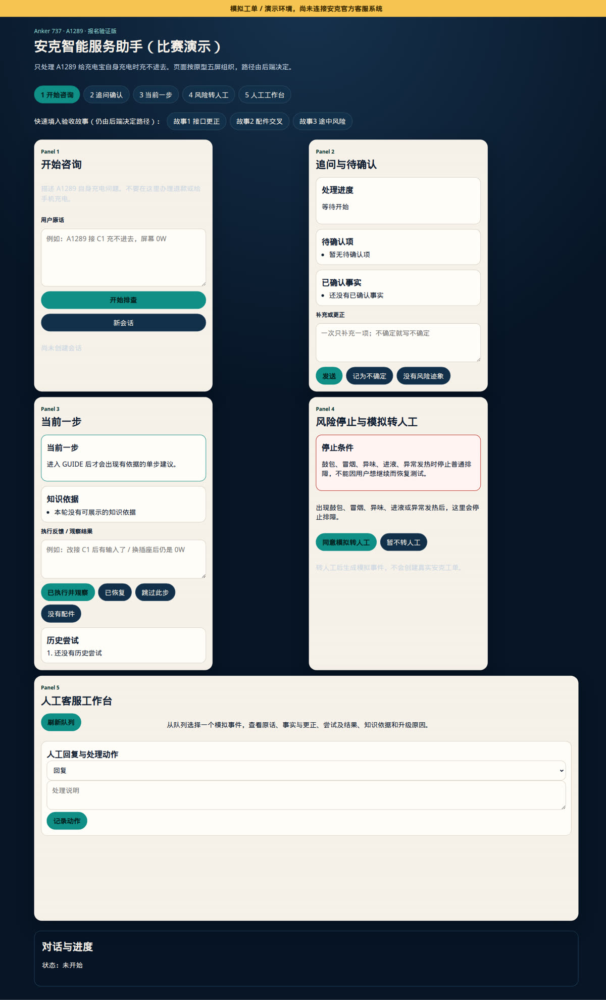
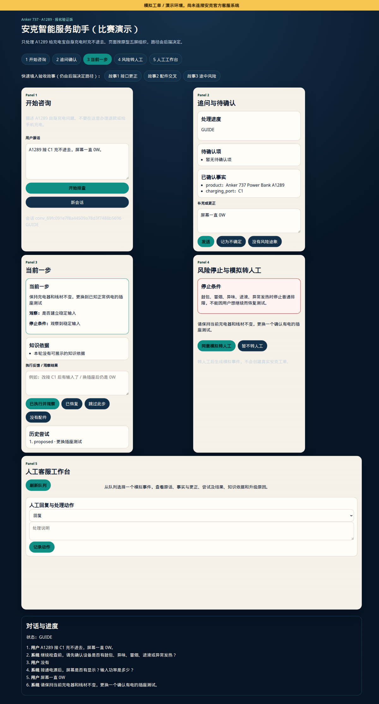
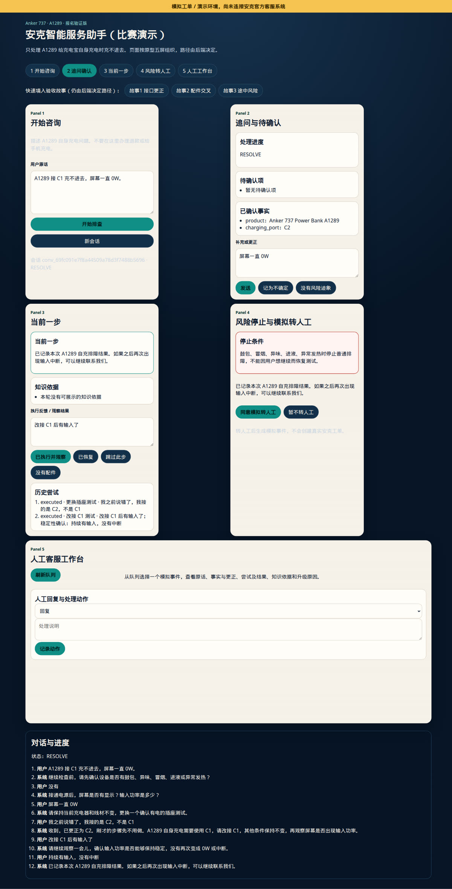
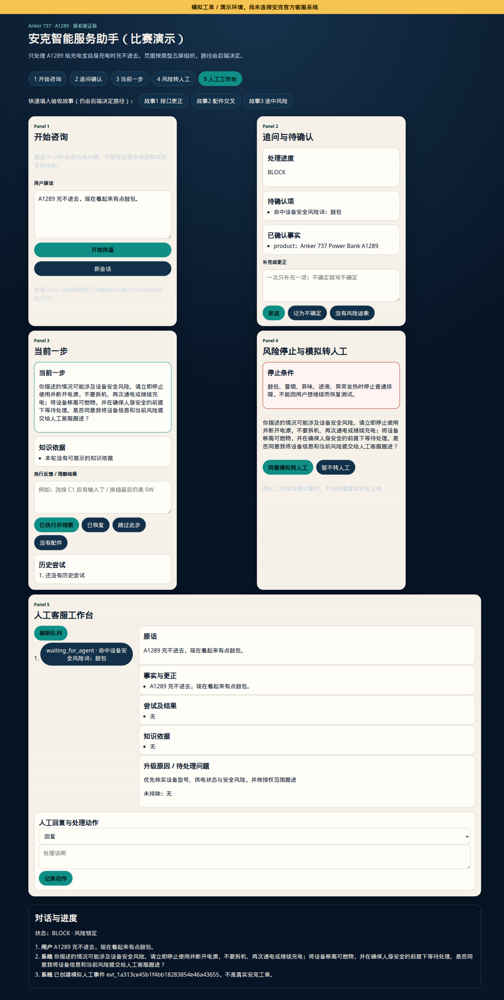
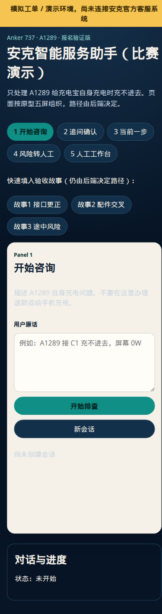

# Anker Smart Service Agent

面向 Anker 737（A1289）自身充电「充不进去」的售后 Demo：先确认事实，再一次只走一步，
遇到鼓包等风险立即停止，不能继续时把进度交给模拟人工。  
后端是 FastAPI；前端是五屏静态页。不接安克官方工单，也不需要 LLM API key。

## 创新点

- **只做一件事**：报名验证版只处理 A1289 给充电宝自身充电；不办退款，不排「充不了手机」。
- **五条路径，一次一步**：信息不够就 `ASK`，有依据就 `GUIDE`（每次只给一步），命中鼓包/冒烟/异味/进液/异常发热就 `BLOCK`，无适用步骤则 `HANDOFF`，用户说恢复后还要 `CONFIRM` 才结案。
- **风险锁**：风险一旦成立，用户下一句「没有风险了」也不会自动恢复测试。
- **更正会局部回退**：用户把 C1 改成 C2 时，只撤回依赖旧事实的 Attempt，型号和配件记录保留。
- **建议 ≠ 执行过**：Attempt 把建议、是否执行、观察结果分开存；转人工时把原话、事实更正、尝试结果和未排除项一起交给客服。
- **Mock 标识固定**：页面顶部写明「模拟工单 / 演示环境，尚未连接安克官方客服系统」。
- **前端不编状态机**：浏览器只提交原话和观察，路径由后端决定。

## 界面预览

宽屏一次看到五屏：开始咨询、追问确认、当前一步、风险转人工、人工工作台。

<p align="center">
  
</p>

故事1：先说接 C1，再更正为 C2，系统撤回不适用步骤，改接 C1 后确认恢复。

<p align="center">
  
</p>

<p align="center">
  
</p>

故事3：途中发现鼓包，停止排障并生成模拟人工事件。

<p align="center">
  
</p>

<p align="center">
  
</p>

## 如何使用

### 1. 本机五屏前端（开发联调）

默认 [`config/development.env`](config/development.env)：本地 MongoDB，`http://127.0.0.1:8000`。

```bash
bash scripts/bootstrap.sh
bash scripts/mongo-dev.sh   # 另开一个 terminal，保持运行
bash scripts/dev.sh         # 默认加载 config/development.env
```

然后打开：

- 五屏前端：<http://127.0.0.1:8000/ui>
- 健康检查：<http://127.0.0.1:8000/health>
- API 文档：<http://127.0.0.1:8000/docs>

前端代码在 [`src/smart_service_agent/web/`](src/smart_service_agent/web/)（`index.html` / `styles.css` / `app.js`）。  
页面顶部点「故事1 / 故事2 / 故事3」可预填原话；路径仍由后端决定。

> `127.0.0.1` 只有你自己的电脑能打开。GitHub 仓库首页默认显示 `main`；当前带截图的 README 在
> `cursor/a1289-ui-five-panels-a6f9` 分支，合并后才会出现在仓库首页。


## 环境要求

- Python 3.9+
- 本机 FastAPI Demo 需要本地 MongoDB；Streamlit Demo 使用内存仓储，不需要 MongoDB

## 已实现能力

- 消费者多轮咨询及 `GUIDE`、`RESOLVE`、`ASK`、`HANDOFF`、`BLOCK` 状态编排；
  `GUIDE` 用于充电设备无法充电单条件排查，`RESOLVE` 用于有审核依据的使用与选型咨询。
- Case 事实版本、更正与未知项，以及建议执行、跳过、观察和结果相互独立的 Attempt 记录；
  A1289 主流程会根据用户反馈自动更新 Attempt，并避免重复建立相同步骤。
- 当前消息优先的风险识别，支持常见否定、假设、第三方主体和已恢复表达。
- 可注入的 LLM 意图识别边界，以及 timeout、非法输出和低置信度 fallback。
- 可注入的 RAG/知识库边界，以及知识可回答性过滤和可追踪 evidence。
- MongoDB 会话、审计、反馈、幂等人工事件和客服动作持久化。
- 人工客服视图、事件队列和基础服务洞察 API。
- Ticket 人工回复、动作完成、用户确认解决和重开事件，以及按原型五屏组织的可点击 Demo 前端。
- 可审计 Eval：数据指纹、`GOLD` / `CHALLENGE` / `HOLDOUT` 隔离、风险门禁和 `run_id` 报告。

当前附件只进行 metadata 校验；系统会明确告知无法读取内容并建议转人工。订单系统、真实文件
存储、登录鉴权和 webhook 等 external integration 尚未选型，不会在演示中伪造已接入状态。

完整 API contract 与演示边界见
[比赛 MVP API](docs/api.md)，实现结构见
[比赛 MVP Backend Architecture](docs/architecture.md)，五屏前端见
[五屏原型前端](docs/ui.md)。

## 质量检查

```bash
bash scripts/check.sh
```

## 项目结构

```text
src/smart_service_agent/      # 应用代码
src/smart_service_agent/web/  # 五屏 Demo 前端（HTML/CSS/JS）
streamlit_app.py              # 公开分享用 Streamlit 入口
tests/                        # 自动化测试
docs/                         # 详细项目文档
docs/images/                  # README 截图
config/                       # environment 配置（含 development.env）
data/                         # 本地数据分层
sandbox/                      # 本地实验区
scripts/                      # 开发与验证脚本
```

## 开发规范

仓库级开发要求见 [AGENTS.md](AGENTS.md)，版本变更记录见
[CHANGELOG.md](CHANGELOG.md)，详细文档索引见 [docs/README.md](docs/README.md)。

config、data、sandbox 和 scripts 的完整说明见
[开发环境文档](docs/development.md)。

Eval 的数据隔离、发布门禁和运行方式见 [可审计服务 Eval](docs/evaluation.md)。

## 当前边界

内置规则与知识仅用于 deterministic demo，不代表 production 模型效果、真实商品知识或正式客服
SLA。上线前仍需接入真实 LLM/RAG、认证与 RBAC、文件处理、订单/售后系统、通知 webhook、分页、
事件认领和并发控制；具体风险和接入顺序见
[Backend Architecture](docs/architecture.md#production-接入路线)。

## 来源与边界

本仓库的通用服务架构最初由团队的
[`ttchu1221/Loreal-ai-service-intelligence`](https://github.com/ttchu1221/Loreal-ai-service-intelligence)
`feat/backend` 分支抽取后重新适配。当前运行时规则、知识、示例和测试均面向充电设备；
内置充电故障知识仅用于可重放 demo，不代表安克官方售后政策、产品数据或 SLA。

数据指纹、分层验证、风险门禁和可审计运行方法由团队的
[`stylewth/Meijian-Narrative-Intelligence`](https://github.com/stylewth/Meijian-Narrative-Intelligence)
方法适配；未复制梅见品牌语料、候选叙事、飞书表数据或历史运行产物。
