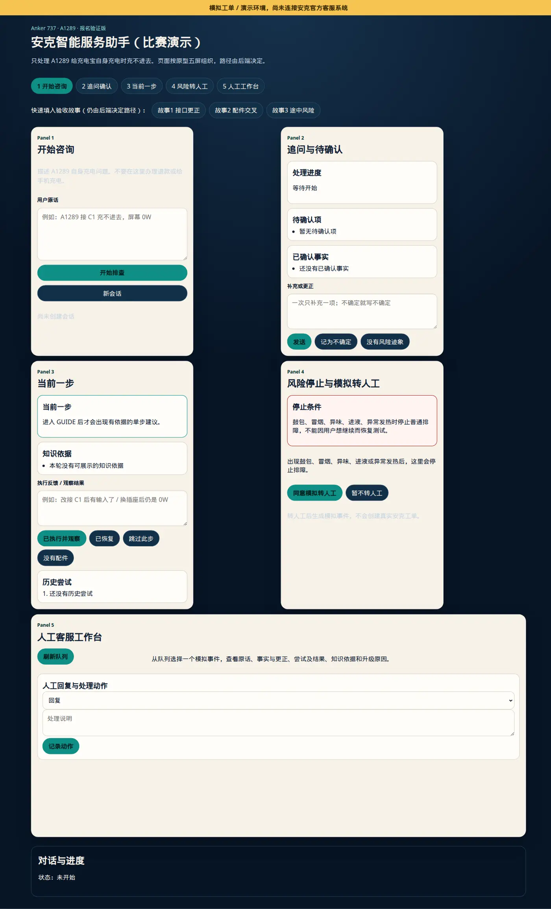
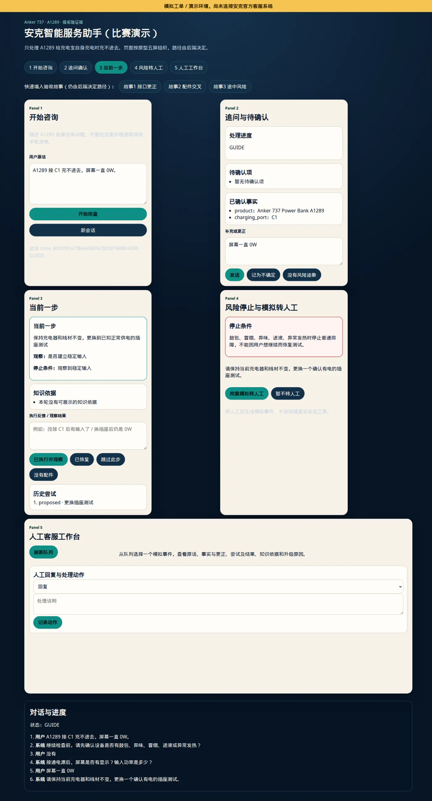
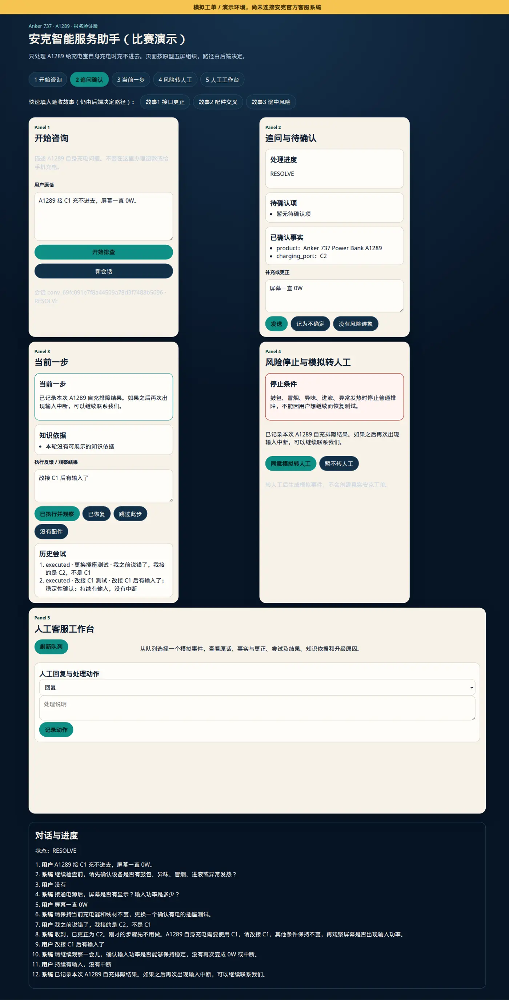
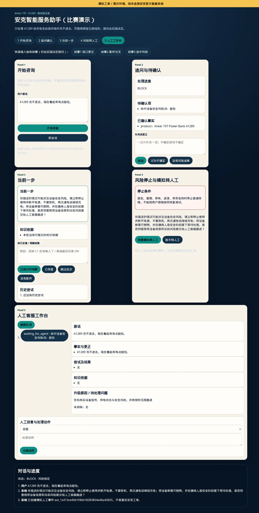
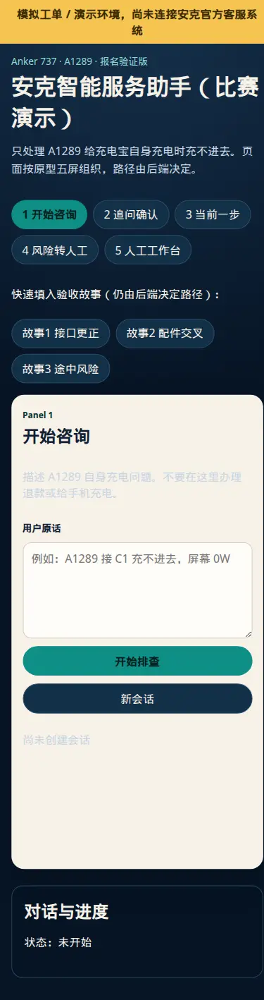

# 五屏原型前端

`GET /ui` 提供 A1289 报名验证版的可点击前端，按原型五屏组织，并直接调用现有 FastAPI：

1. 开始咨询
2. 追问与待确认
3. 当前一步 / 执行反馈
4. 风险停止与模拟转人工
5. 人工客服工作台

前端源码在 [`src/smart_service_agent/web/`](../src/smart_service_agent/web/)：

| 文件 | 作用 |
|---|---|
| `index.html` | 五屏结构和三条演示故事 |
| `styles.css` | 桌面五屏 / 窄屏单屏样式 |
| `app.js` | 调用现有 FastAPI，不在浏览器里实现状态机 |

由 `ui_assets.py` 按白名单提供上述文件。不引入 React、npm 或其他 frontend framework。

## 如何运行 Demo

默认配置是 [`config/development.env`](../config/development.env)，也是本次截图使用的环境：

- `APP_ENV=development`
- `APP_HOST=127.0.0.1`、`APP_PORT=8000`
- `MONGODB_URI=mongodb://127.0.0.1:27017`
- `MONGODB_DATABASE=smart_service_agent`
- `RULE_VERSION=risk-rules-v1`
- `KNOWLEDGE_VERSION=demo-knowledge-v1`

```bash
bash scripts/bootstrap.sh
bash scripts/mongo-dev.sh   # 另开一个 terminal，保持运行
bash scripts/dev.sh         # 不传参数即加载 config/development.env
```

然后打开：

- 五屏前端：<http://127.0.0.1:8000/ui>
- 兼容入口：<http://127.0.0.1:8000/workspace/consumer>
  与 <http://127.0.0.1:8000/workspace/agent>

`scripts/dev.sh config/production.env` 会改监听地址和日志级别，不改变五屏页面或 A1289 规则。
`pytest` 使用 `MemoryRepository`，不读取 `development.env`，也不需要 MongoDB。

页面顶部固定显示「模拟工单 / 演示环境，尚未连接安克官方客服系统」。
宽屏下五屏同时可见；窄屏一次只显示一屏，可用顶部导航切换。`/workspace/agent` 会直接打开人工工作台。











## Input / Output

消费者操作只提交：

- `POST /v1/conversations` 与 `POST /v1/conversations/{id}/messages`：用户原话、补充、观察与确认。
  请求固定带 `product: "Anker 737 Power Bank A1289"`。
- `PATCH /v1/conversations/{id}/attempts/{attempt_id}`：记录执行、跳过或配件不可用；随后仍发消息让
  编排器推进。
- `POST /v1/conversations/{id}/handoff`：同意或暂不模拟转人工。

人工工作台读取：

- `GET /v1/agent/events`
- `GET /v1/agent/conversations/{id}`
- `POST /v1/agent/events/{event_id}/actions`

页面同时读取 `GET /v1/conversations/{id}/case` 和 `.../attempts`，展示已确认事实与历史尝试。

## Error case

- 空白消息不会提交。
- API `4xx/5xx` 会显示在页面错误条，不展示 stack trace 或 secret。
- 未知静态文件和路径穿越返回 `404`。

## 行为边界

- 前端只提交用户原话、观察和客服动作，不在浏览器里拼 `ASK` / `GUIDE` / `BLOCK` / `HANDOFF` 状态机。
- 三条演示故事按钮只预填用户原话，路径仍由后端 A1289 规则决定。
- 未接入登录鉴权；该页面只用于内部联调和报名验证 Demo。
- 转人工只创建模拟事件，不得显示为真实安克工单。

原型图 ZIP 未进入本仓库；页面结构按冻结表五屏与消费者/人工端统一用语实现，而不是像素级还原。

要发给别人打开时，不要用 `127.0.0.1:8000/ui`。改用 [Streamlit 公开 Demo](streamlit-demo.md)。
